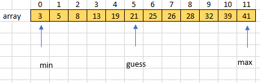
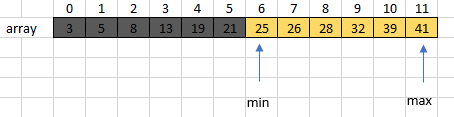
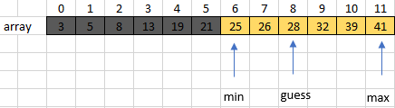

# Búsqueda Binaria
La búsqueda binaria es un algoritmo eficiente para encontrar un elemento en una lista ordenada de elementos. Funciona al dividir repetidamente a la mitad la porción de la lista que podría contener al elemento, hasta reducir las ubicaciones posibles a solo una. 
## Implementar la búsqueda binaria de un arreglo
Supon que tenemos un *arreglo*  array = [3,5,8,13,19,21,25,26,28,32,39,41] y quetemos encontrar **"target = 28"**,
como el *arreglo* tiene: 
**12 elementos** 
los indices del arreglo van desde: 
**min = 0**  
**max = 11** 
El primer intento de la búsqueda binaria entonces en el indice **5 (que es (0+11)/2)**  
¿**array[5]** es igual a **28**? No, **array[5] es 21**  
 
¿El indice que buscamos es mayor o menor que **5**? 
Como los valores en el arreglo están en orden ascendente, y **21 < 28**, el valor **28** debe estar a la derecha del índice **5**. En otras palabras, el índice que estamos tratando de adivinar debe ser mayor que **5**. Actualizamos el valor de **min** a **5 + 1, o 6,** y dejamos **max** sin cambio en **11**. 
 
¿Cuál es el siguiente índice que intentamos? El promedio de **6 y 11 es 8.5**, el cual redondeamos hacia abajo a **8**, puesto que un índice de un arreglo debe ser un entero. Encontramos que **array[8] es 28**. 

## Pseudocódigo
<ul>
    <li>Sea min = 0 y max = n-1.
    <li>Calcula guess como el promedio de max y min, redondeado hacia abajo (para que sea un entero)
    <li>Si array[guess] es igual a target, entonces detente. ¡Lo encontraste! Regresa guess.
    <li>Si el intento fue demasiado bajo, es decir, array[guess] < target, entonces haz min = guess + 1.
    <li>De lo contrario, el intento fue demasiado alto. Haz max = guess - 1.
    <li>Regresa al paso 2
</ul>
